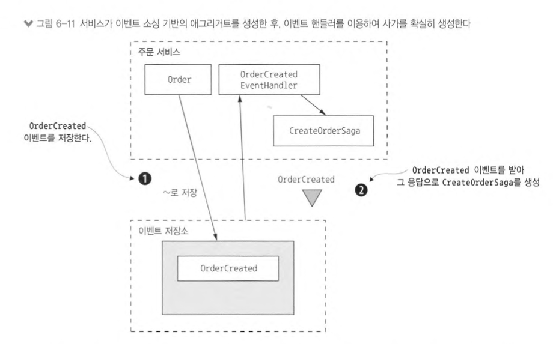
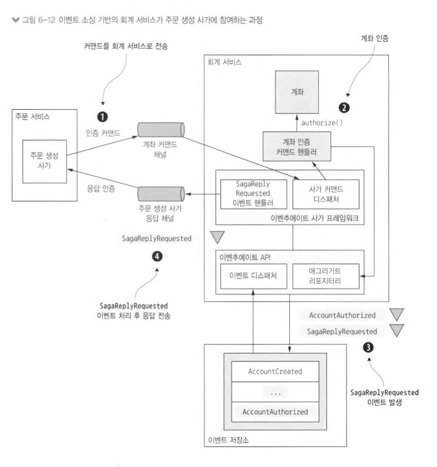

# 이벤트 소싱 응용 비즈니스 로직 개발

이벤트 소싱은 비즈니스 로직을 구성하고 애그리거트를 저장하는 또 다른 방법입니다. <br>
이벤트는 각 애그리거트의 상태 변화를 나타냅니다.

### 이벤트는 곧 상태 변화

도메인 이벤트는 애그리거트의 변경을 구독자에게 알리는 장치로. 이벤트는 애그리거트 ID 같은 최소한의 필수 데이터만 넣거나 컨슈머에 유용한 데이터까지 포함시켜 강화할 수 있습니다. <br>
어떤 이벤트에 무엇을 전달할지는 컨슈머의 필요에 따라 좌우되지만, 이벤트 소싱에서는 주로 애그리거트에 의해 이벤트 및 그 구조가 결정됩니다.

또 이벤트는 애그리거트가 상태 전이를 하기 위해 필요한 데이터를 갖고 있어야 합니다. <br>
Order.state처럼 객체 필드 값을 바꾸는 정도의 간단한 상태 변화도 있겠지만, 주문 품목 변경 등 객체의 추가/삭제 작업이 동 반되는 상태 변화도 있습니다.

OrderShippedEvent 같은 이벤트는 데이터는 거의 없고 상태 전이만 나타냅니다. apply()는 Order 상태를 SHIPPED로 변경할 뿐입니다. <br>
하지만 다른 이벤트에는 많은 데이터가 들어 있습니다. 가령 OrderCreatedEvent는 apply()가 Order를 비롯하여 주문 품목 및 지불 정보, 배달 정보 등을 초기화하기 위해 필요한 데이터를 모두 갖고 있어야 합니다.

```java
public class Order {

    public List<Event> process(ReviseOrder command) {
        OrderRevision orderRevision = command.getOrderRevision();

        switch (state) {
            case APPROVED:
                LineltemQuantityChange change = orderLineItems.lineltemQuantityChange(orderRevision);
                if (change.newOrderTotal.isGreaterThanOrEqual(orderMinimum)) {
                    throw new OrderMinim니mNotMetException();
                }
                return singletonList(new OrderRevisionProposed(orderRevision, change.currentOrderTotal, change.newOrderTotal));
            default:
                throw new UnsupportedStateTransitionException(state);
        }
    }

    public void apply(OrderRevisionProposed event) {
        this.state = REVISION_PENDING;
    }

    public List<Event> process(ConfirmReviseOrder command) {
        OrderRevision orderRevision = command.getOrderRevision();

        switch (state) {
            case REVISION_PENDING:
                LineltemQuantityChange licd = orderLineItems.lineltemQuantityChange(orderRevision);
                return singletonList(new OrderRevised(orderRevision, licd.currentOrderTotal, licd.newOrderTotal));
            default:
                throw new UnsupportedStateTransitionException(state);
        }
    }

    public void apply(OrderRevised event) {
        OrderRevision orderRevision = event.getOrderRevision();
        if (!orderRevision.getRevisedLineItemQuantities().isEmpty()) {
            orderLineltems.updateLineltems(orderRevision); 
        }
        this.state = APPROVED;
    }
}
```

### 동시 업데이트: 낙관적 잠금

애그리거트 루트를 VERSION 컬럼이 있는 테이블에 매핑하고 애그리거트가 업데이트될 때마다 UPDATE 문으로 값을 하나씩 증가시킵니다. <br>
애플리케이션이 애그리거트를 읽는 시점에 버전이 바뀌지 않았다면 UPDATE 문은 성공할 것입니다. <br>
그러나 두 트랜잭션이 같은 애그리거트를 읽는다면 첫 번째 트랜잭션은 성공적으로 애그리거트를 업데이트하고, 두 번째 트랜잭션은 그 사이 버전 번호가 바뀌었으니 실패합니다.


# 사가와 이벤트 소싱을 접목

이벤트 소싱에서는 코레오그래피 사가를 쉽게 이용할 수 있습니다. <br>
참여자는 자신의 애그리거트가 발생시킨 도메인 이벤트를 교환하고, 각 참여자의 애그리거트는 커맨드를 처리하고 새로운 이벤트를 발생시키는 식으로 이벤트를 처리합니다. <br>
물론 애그리거트 및 애그리거트를 업데이트하는 이벤트 핸들러 클래스는 여러분이 작성해야 합니다.

하지만 이벤트 소싱 기반의 비즈니스 로직을 오케스트레이션 기반의 사가에 연계하는 일은 훨씬 어려울 수 있습니다. <br>
이벤트 저장소를 사용하는 애플리케이션은 애그리거트 하나만 생성/수정하고 결과 이벤트(들)를 발행할 수 있는데, 사가의 각 단계는 다음과 같이 반드시 원자적으로 수행되어야 하는 액션들로 구성됩니다.

- 사가 생성: 사가를 시작한 서비스는 원자적으로 애그리거트를 생성/수정하고 사가 오케스트 레이터를 생성해야 합니다. 예를 들어 주문 서비스의 createOrder()는 Order 애그리거트와 CreateOrderSaga를 생성해야 합니다.
- 사가 오케스트레이션: 사가 오케스트레이터는 원자적으로 응답을 소비하고, 자신의 상태를 업데이트한후 커맨드 메시지를 전송해야 합니다.
- 사가 참여자: 주방 서비스, 주문 서비스 등 사가 참여자는 원자적으로 메시지를 소비하고, 중복 메시지를 솎아 내고, 애그리거트를 생성/수정하고, 응답 메시지를 전송해야 합니다.

이처럼 이벤트 저장소의 트랜잭션 능력과 요건 사이에 맞지 않는 부분이 있기 때문에 오케스트레이션 사가와 이벤트 소싱을 연계하는 작업은 쉽지 않은 도전이 될 가능성이 있습니다.

## 코레오그래피 사가 구현: 이벤트 소싱

이벤트 소싱은 속성상 이벤트가 모든 것을 주도하므로 코레오그래피 사가를 아주 쉽게 구현할 수 있습니다. <br>
애그리거트가 업데이트되면 사가가 이벤트를 발생시키고, 제각기 배정된 이벤트 핸들러는 해당 이벤트를 소비한 후 애그리거트를 업데이트합니다.

4장에서는 주문 생성 사가를 코레오그래피 기반으로 구현하는 방법을 설명했습니다. <br>
ConsumerService. KitchenService, AccountingService는 OrderService의 이벤트를 구독하고, 반대로 OrderService 역시 이 세 서비스의 이벤트를 구독합니다. <br>
이벤트 핸들러가 해당 애그리거트를 업데이트하면 또 다른 이벤트가 발생합니다.

코레오그래피 사가는 단순해서 좋지만 단점도 많습니다. <br>
사가 코레오그래피에 이벤트를 사용하면 이벤트의 목적이 이원화되는 문제입니다. <br>
이벤트 소싱은 상태 변화를 나타내기 위해 이벤트를 이용하는데, 이벤트를 사가 코레오그래피에 갖다 쓰면 애그리거트는 상태 변화가 없어도 무조건 이벤트를 발생시켜야 합니다. <br>
가령 애그리거트를 업데이트 하면 비즈니스 규칙에 위배될 경우. 애그리거트는 반드시 이벤트를 발생시켜 오류를 보고해야 합니다.

## 오케스트레이션 사가 생성

사가 오케스트레이터는 일부 서비스 메서드에 의해 생성됩니다. <br>
OrderService.createOrder() 같은 다른 서비스 메서드는 애그리거트를 생성/수정하고 사가 오케스트레이터를 생성하는 두 가지 일을 합니다. <br>
서비스는 이 두 가지 액션을 첫 번째 액션이 수행되면 두 번째 액션은 최종적으로 실행되는 방식으로 수행합니다.

### 사가 오케스트레이터 작성: RDBMS 이벤트 저장소 사용 서비스

RDBMS 이벤트 저장소를 사용하는 서비스에서는 이벤트 저장소를 업데이트하고 사가 오케스트레이터를 생성하는 작업을 한 트랜잭션으로 묶을 수 있습니다.

```java
public class OrderService {

    @Autowired
    private SagaManager<CreateOrderSagaState> createOrderSagaManager;

    @Transactional
    public EntityWithIdAndVersion<Order> createOrder(OrderDetails orderDetails) {
        EntityWithIdAndVersion<Order> order = orderRepository.save(new CreateOrder(orderDetails));

        CreateOrderSagaState data = new CreateOrderSagaState(order.getId(), orderDetails);

        createOrderSagaManager.create(data, Order.class, order.getld());

        return order;
    }
}
```

### 사가 오케스트레이터 작성: NoSQL 이벤트 저장소 사용 서비스

NoSQL 이벤트 저장소를 사용하는 서비스는 이벤트 저장소를 업데이트하고 사가 오케스트레이터를 생성하는 액션을 원자적으로 수행할 수 없습니다. <br>
그 대신 서비스는 애그리거트가 발생시킨 도메인 이벤트에 반응하여 사가 오케스트레이터를 생성하는 이벤트 핸들러를 갖고 있어야 합니다.



사가 오케스트레이터를 생성하는 이벤트 핸들러를 작성할 때 주의할 점은 중복 이벤트를 처리해야 한다는 사실입니다.  <br>
적어도 한 번은 메시지를 전달하기 때문에 사가를 생성하는 이벤트 핸들러 가 여러 번 호출될 수도 있겠죠.

사가 인스턴스를 정확히 하나만 생성하도록 하려면, 이벤트의 유일한 속성에서 사가 ID를 추출해야 합니다. <br>
이벤트를 발생시킨 애그리거트 ID를 사가 ID로 쓰거나, 이벤트 ID를 사가 ID로 쓰는 것입니다.

## 이벤트 소싱 기반의 사가 참여자 구현

### 예제: 이벤트 소싱 기반의 사가 참여자



1. 주문 생성 사가가 계좌 인증 커맨드를 메시징 채널을 통해 회계 서비스로 보냅니다.
2. AccountingServiceCommandHandler는 주어진 Accounting 애그리거트로 커맨드를 전송합니다.
3. 애그리거트가 AccountAuthorizedEvent와 SagaReplyRequestedEvent 두 이벤트를 발생시킵니다.
4. SagaReplyRequested 이벤트 핸들러는 주문 생성 사가에 응답 메시지를 전송하여 SagaReplyRequestedEvent를 처리합니다.